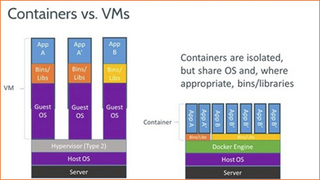

# Partie 1 : Qu'est-ce que la conteneurisation ?

La conteneurisation est une approche informatique qui consiste à regrouper une application avec toutes ses dépendances logicielles et bibliothèques associées dans un environnement isolé appelé conteneur.

Cela permet de réduire les charges au démarrage et de supprimer la nécessité de configurer des systèmes d'exploitation invités distincts pour chaque application, car ils partagent tous un seul noyau de système d'exploitation

# Partie 2 : Les avantages

## Portabilité :

C'est un conteneur d'application crée un progiciel exécutable qui est isolé par rapport au système d'exploitation hôte. Donc, il ne dépend pas du système d'exploitation hôte et n'est pas lié à celui-ci, cela le rend portable et lui permet de s'exécuter de manière cohérente et uniforme sur n'importe quelle plate-forme ou cloud.

## Isolation :

La conteneurisation permet d'isoler une application et de la faire fonctionner de façon indépendante. C'est-à-dire si un conteneur est défaillant alors sa défaillance n'affecte pas le bon fonctionnement des autres.
Ce qui permet au développeur d'identifier le problèmes sans mettre à l'arrêt les autres.

## Efficacité :

les logiciels qui marche dans des environnements conteneurisés partagent le noyau du système d'exploitation de la machine hôte. Cela permet au développeurs de partager les couches d'application entre les différents conteneurs.
De plus les conteneurs, sont moins gros que les machines virtuelles, ce qui permet au développeur d'exécuter davantage de conteneurs sur la même capacité de calcul qu'une seule machine virtuelle.
Donc cela permet l'efficacité des serveurs est accrue et les coûts liés aux serveurs et aux licences sont diminués.

## Scalabilité :
(c'est le point que j'ai le plus de mal à comprendre)

La scalabilité des conteneurs permet au entreprise de déployer des applications sur un cluster de serveurs cloud. Ce qui leur permet d'augmenter ou de diminuer la capacité de ses applications en fonction des besoins.

# Partie 3 : Schéma

On peut voir plusieurs points communs entre une VM et un conteneur :

- Isolation
- Portabilité
- Automatisation

et aussi les différences :

- Simplicité
- Performance
- Scalabilité

Pour conclure, on peut facilement dire que les VM et les conteneurs sont deux technologies qui sont similaires même si on peut noter que les VM sont plus complexes et plus performantes, mais elles sont plus coûteuses à mettre en œuvre et à gérer.
Tandis que les conteneurs sont plus simple à mettre en place, plus performant.

# Partie 4 : Ligne de commande

1. `docker ps`  : Cela affiche la liste des conteneurs actuellement en cours d'exécution sur votre système.
2. `docker logs`  : Affiche les journaux (logs) d'un conteneur spécifié. 
3. `docker run` : Cette commande permet de créer et de démarrer un conteneur basé sur une image Docker spécifiée.
4. `docker create` : Ça crée un conteneur à partir d'une image spécifiée, mais ne le démarre pas.
5. `docker exec` : Utilisée pour exécuter des commandes à l'intérieur d'un conteneur en cours d'exécution.
EX: command docker exec -it <container name> /bin/bash : ouvre un shell interactif dans le conteneur spécifié.
6. `docker stop [container ID]` : Arrête le conteneur spécifié.
7. `docker rm [container ID]` : Supprime le conteneur spécifié. 
8. `docker inspect [container ID]` : Fournit des informations détaillées sur le conteneur spécifié
___
9. `docker images` : Affiche la liste des images Docker disponibles localement sur votre machine.
10. `docker push` : Envoie votre image vers le registre Docker, la rendant accessible à d'autres utilisateurs.
11. `docker pull` : Télécharge une image Docker depuis un registre.
12. `docker commit` : Crée une nouvelle image à partir des modifications apportées à un conteneur en cours d'exécution. 
13. `docker rmi` : Supprime une ou plusieurs images Docker.
___
14. `docker volume` : Permet de créer un volume Docker.
15. `docker network` : Utilisée pour créer un réseau Docker.
16. `docker build` : Cette commande est utilisée pour construire une nouvelle image Docker à partir d'un fichier Dockerfile.
17. `docker --version` : Cette commande est utilisée pour connaitre la version de docker.
18. `docker restart` : Redémarre le conteneur Docker avec l'ID de conteneur mentionné dans la commande.
19. `docker kill` : Arrête immédiatement le conteneur.

___
20. `docker login` : Cela permet de se connecter au hub docker.
21. `docker info` : Cela permet d'obtenir des informations détaillées sur le docker installé sur le système
